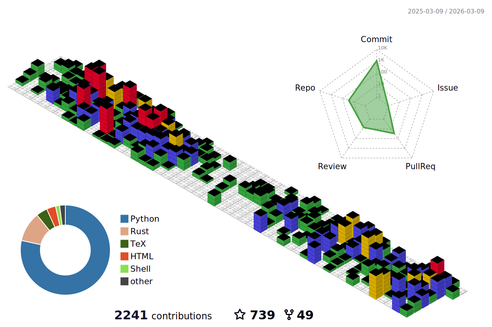

## Hello, I'm [Tae-Geun Kim](https://axect.github.io)  👋
  

	
  
  

### 🙋‍‍♂️ Introduce myself

#### 👨‍‍🏫 Graduate Students at Physics

* [Yonsei HEP-COSMO](http://nexus.yonsei.ac.kr)
* Department of Physics, Yonsei University

#### ❤️ Interests

* Scientific computation
* Machine Learning / Deep Learning / Statistics
* Astrophysics, Cosmology and Particle physics
* Quantum Computing

### ▶️ Status

### 📚 Portfolio

### 👨‍‍💻 Tech Skills

### :octocat: Github contributions

### 🏆 Trophies

	<b>More specific</b>

	
### 🔖 Skills

#### 🔢 Mathematics

* Functional Analysis
* Differential Geometry
* Numerical Analysis

#### 🍎 Physics

* Quantum Field Theory
* General Relativity
* Mathematical Physics

#### 💻 Programming

* **Main Languague** : Rust
* **Sub Languages** : C++, Julia, R, Python
* **Frameworks or Libraries**
    * Numerical: peroxide, BLAS, LAPACK, numpy, scipy
    * Visualization: matplotlib, vegas, ggplot2, plotly
    * Web: Django, Vue, Firebase, Surge, Hugo
    * Machine Learning: Scikit-Learn
    * Deep Learning: PyTorch, Flux
	

