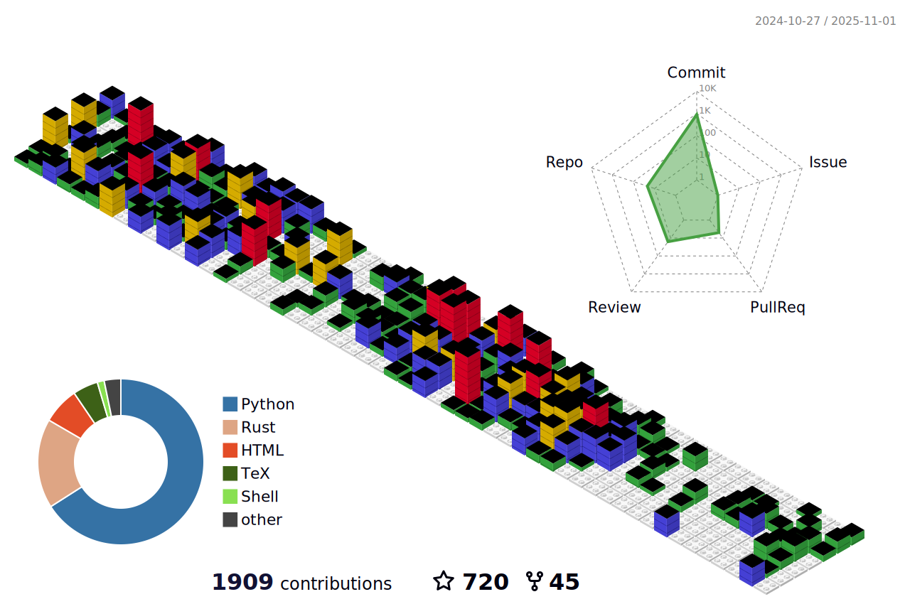

## Hello, I'm [Tae-Geun Kim](https://axect.github.io) 👋

### 🙋‍♂️ Introduce myself

#### 👨‍🏫 Postdoctoral Researcher in Physics

* Institute of Modern Physics, Fudan University & RIKEN iTHEMS
* [Curriculum Vitae](https://github.com/Axect/cv_typst/blob/main/cv.pdf) · [Google Scholar](https://scholar.google.com/citations?user=Gnat36QAAAAJ) · [ORCID](https://orcid.org/0009-0000-4229-2935)
* [Blog](https://axect.github.io)

#### 🔬 Research Areas

* AI for Science — neural operators, physics-informed deep learning, Hamiltonian learning
* Dark matter physics — axion-like particles, primordial black holes, detectability studies
* Scientific & High Performance Computing — numerical algorithms, Rust-based tools, parallel computing

### 💼 Portfolio

#### [Peroxide](https://github.com/Axect/Peroxide)

- Comprehensive Rust numeric library for linear algebra, numerical analysis, statistics, and machine learning
- Supports automatic differentiation, special functions, DataFrame, and BLAS/LAPACK integration
- User-friendly syntax inspired by R, NumPy, and MATLAB

#### [HyperbolicLR](https://github.com/Axect/HyperbolicLR)

- Novel learning rate schedulers addressing the learning curve decoupling problem in deep learning
- Epoch-insensitive design enables stable training across varying durations without retuning
- Evaluated on image classification, time series prediction, and operator learning tasks with PyTorch

#### [arXiv Explorer](https://github.com/Axect/arXiv_explorer)

- Personal research assistant for arXiv — discover, organize, and annotate papers from the terminal
- TF-IDF content similarity + category/keyword/recency scoring for personalized recommendations
- Full TUI, AI summaries (Gemini/Claude/OpenAI/Ollama), reading lists, and export to Markdown/JSON/CSV

#### [Puruspe](https://github.com/Axect/Puruspe)

- Pure Rust special functions library (gamma, beta, error functions) with zero dependencies
- Lightweight implementation based on "Numerical Recipes" algorithms

#### [Forger](https://github.com/Axect/Forger)

- Reinforcement Learning library in Rust with modular agents, environments, and policies
- Includes Epsilon Greedy, Value Iteration, and Q-Learning implementations

	<b>More projects</b>

#### [PyTorch Template](https://github.com/Axect/PyTorch-Template)

- Flexible PyTorch experiment template with YAML-based configuration
- Supports multiple seeds, device selection, and LR scheduling for reproducible ML research

#### [Radient](https://github.com/Axect/Radient)

- Rust automatic differentiation library using computational graphs
- Forward/backward propagation with cached and non-cached gradient options

#### [DeeLeMa](https://github.com/Yonsei-HEP-COSMO/DeeLeMa)

- Deep learning network for mass and momentum estimation in high-energy collider events
- Robust mass peak recovery under combinatoric uncertainties and detector smearing

### 📚 Publications
- Yongsoo Jho, **Tae-Geun Kim**, Jong-Chul Park, Seong Chan Park and Yeji Park, *Primordial Black Holes as a Factory of Axions: Extragalactic Photons from Axions*, [Prog. Theor. Exp. Phys. ptag011](https://doi.org/10.1093/ptep/ptag011), [arXiv:2212.11977](https://arxiv.org/abs/2212.11977) (2026)

- Taehyeun Kim, **Tae-Geun Kim**, Anouk Girard, Ilya Kolmanovsky, *Learning Hamiltonian Dynamics with Bayesian Data Assimilation*, [arXiv:2501.18808](https://arxiv.org/abs/2501.18808) (2025)

- **Tae-Geun Kim**, Seong Chan Park, *Neural Hamilton: Can A.I. Understand Hamiltonian Mechanics?*, [arXiv:2410.20951](https://arxiv.org/abs/2410.20951) (2024)

- **Tae-Geun Kim**, *HyperbolicLR: Epoch insensitive learning rate scheduler*, [arXiv:2407.15200](https://arxiv.org/abs/2407.15200) (2024)

- Chang Min Hyun, **Tae-Geun Kim**, and Kyounghun Lee, *Unsupervised sequence-to-sequence learning for automatic signal quality assessment in multi-channel electrical impedance-based hemodynamic monitoring*, [CMPB 108079](https://doi.org/10.1016/j.cmpb.2024.108079), [arXiv:2305.09368](https://arxiv.org/abs/2305.09368) (2023)

- Kayoung Ban, Dong Woo Kang, **Tae-Geun Kim**, Seong Chan Park and Yeji Park, *DeeLeMa : Missing information search with Deep Learning for Mass estimation*, [Phys. Rev. Research **5**, 043186](https://journals.aps.org/prresearch/abstract/10.1103/PhysRevResearch.5.043186), [arXiv:2212.12836](https://arxiv.org/abs/2212.12836) (2022)

### 🔖 Skills

* **Primary Languages** : Rust, Python, C++, Julia
* **Frameworks & Libraries**
    * Numerical Computing: peroxide, numpy, scipy, pandas/polars, BLAS/LAPACK, eigen, mathematica
    * Machine Learning: PyTorch, JAX/Equinox/Optax, W&B, Optuna, Candle, TensorFlow, Scikit-Learn
    * Visualization: matplotlib, vegas, ggplot2, plotly
    * High Energy Physics: BlackHawk, GALPROP, MadGraph, ROOT
    * Quantum Computing: PennyLane, Qiskit, Cirq, RustQIP
    * Web: Django, Vue, Firebase, Hugo, Zola, Elm

### :octocat: Github contributions

